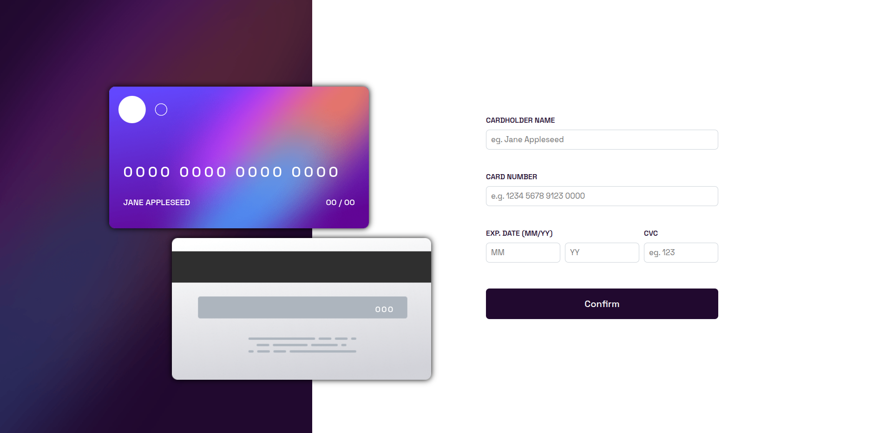
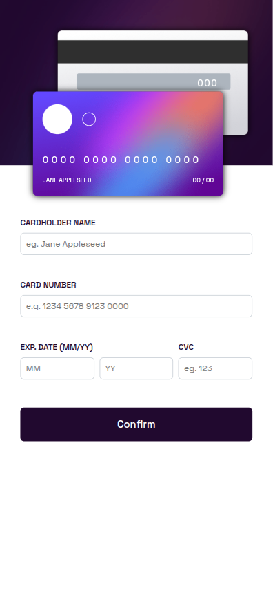
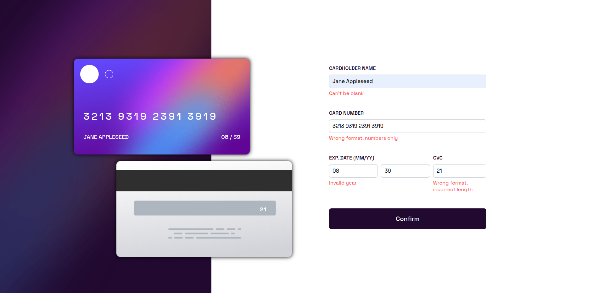
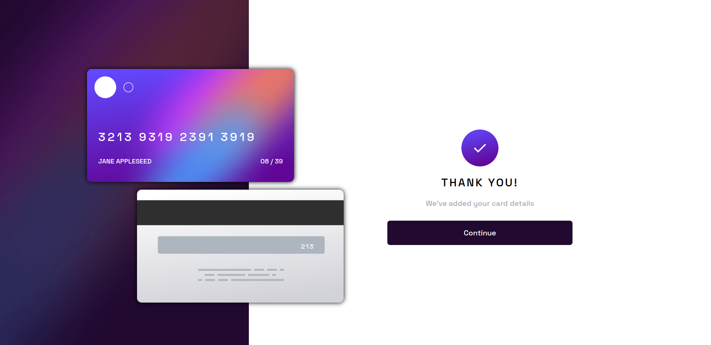
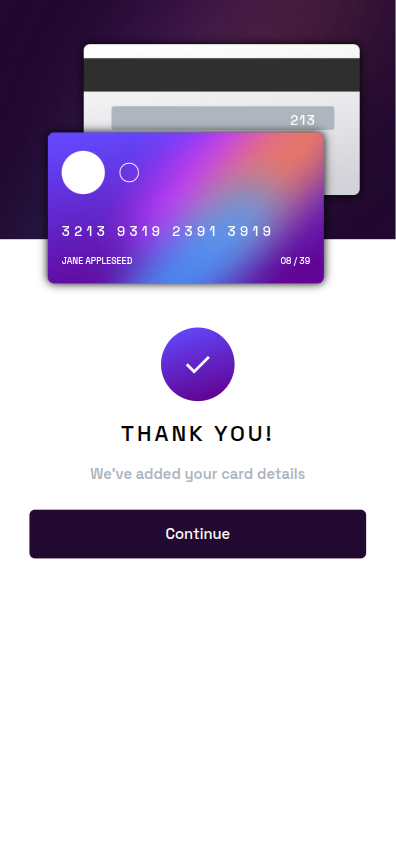

# Frontend Mentor - Interactive card details form solución

Esta es una solución de [Interactive card details form challenge on Frontend Mentor](https://www.frontendmentor.io/challenges/interactive-card-details-form-XpS8cKZDWw). Los desafíos de Frontend Mentor ayudan a mejorar tus habilidades de programación construyendo proyectos realistas.

## Tabla de contenidos

- [Resumen](#resumen)
  - [El desafío](#el-desafio)
  - [Capturas de pantalla](#capturas-de-pantalla)
  - [Links](#links)
- [Mi proceso](#mi-proceso)
  - [Construido con...](#construido-con)
  - [Que aprendi](#que-aprendi)
- [Autor](#autor)

## Resumen

### El desafio

Los usuarios deberían poder hacer/ver:

- Cargar datos de su tarjeta en el formulario
- Visualizar mensajes de error en caso de colocar datos inválidos
- Visualizar en tiempo real, en el anverso y dorso de la tarjeta, los datos ingresados
- Diseño adaptable tanto para escritorios como para celulares
- Ver mensaje de éxito en caso de poner datos válidos

### Capturas de pantalla

### Links

- Visualización del sitio en tiempo real: 

## Mi proceso

### Construido con...

- HTML5
- CSS
- Flexbox
- CSS Grid
- Mobile-first workflow
- JavaScript - VanillaJS

### Que aprendi

Pude aprender a comprender mejor el funcionamiento de CSS para lograr diseños más realistas.
Además, pude mejorar mi lógica de programación mediante la descripción del flujo de la aplicación, lo que me permitió organizar de manera adecuada cada archivo, función y módulo del proyecto, dando como resultado una arquitectura más sólida que contribuye a su correcto funcionamiento.

## Author

- Website - [Juan Cruz Tobares | Portfolio - Site](https://juancruz.dev)
- Frontend Mentor - [@juantobares4](https://www.frontendmentor.io/profile/juantobares4)
- Gmail - [@gmail.com](mailto:juantobares4@gmail.com)